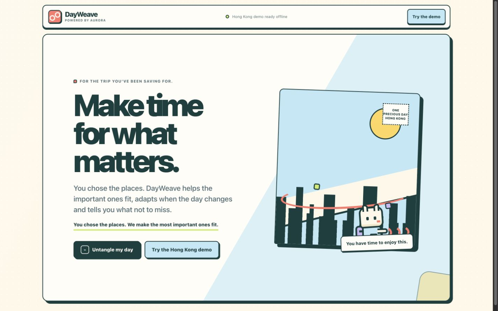
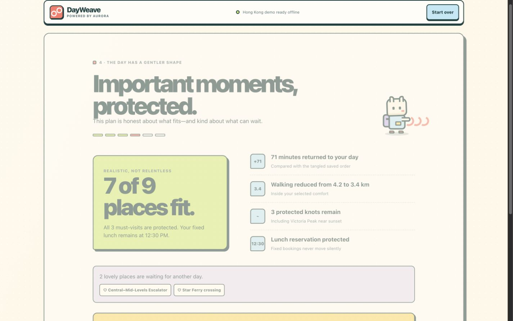
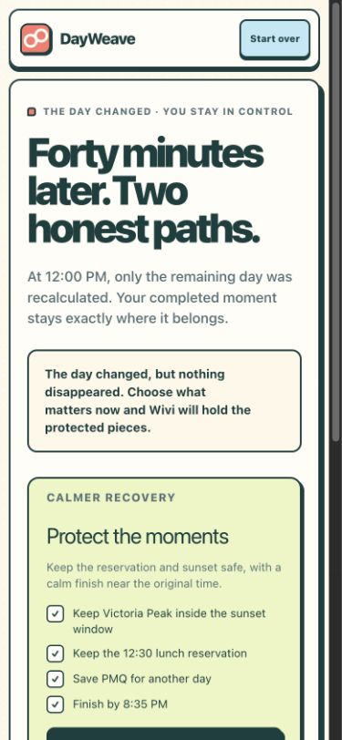
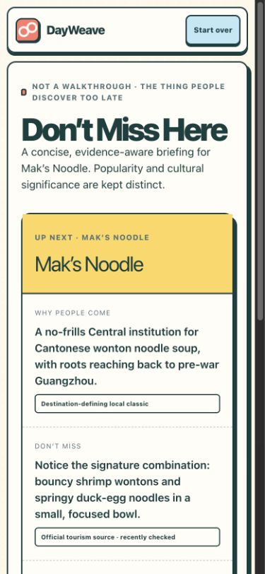
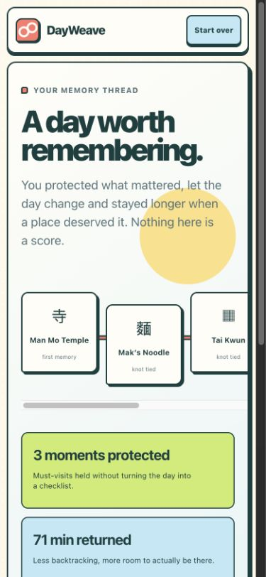

# DayWeave

**Make time for what matters.**

DayWeave is a calm, mobile-first wishlist maximizer for one meaningful day in
Hong Kong. A traveller brings the places they already care about; DayWeave
works out what can honestly fit, protects the important moments, and offers one
clear next decision when the day changes. It is not a generic itinerary
generator, travel chatbot, checklist game, or replacement for a maps app.

> You chose the places. We make the most important ones fit.

The consumer product is **DayWeave**. Its underlying planning system is
**AURORA: Adaptive User-led Route Optimization & Recommendation Assistant**.
AURORA interprets wishes, verifies feasible routes, and explains trade-offs;
the traveller always confirms priorities and chooses recovery options.

## Run locally

Requirements: Node.js 22.13 or newer and npm.

```bash
cd /Users/elisabethlevana/Documents/iOS/dayweave
npm install
cp .env.example .env.local
npm run dev
```

Open the local URL printed in the terminal. An OpenAI key is optional: pasted
notes are matched locally against the supported Hong Kong catalog, while **Try
the Hong Kong demo** provides the complete scripted journey without remote AI
or routing services. A key adds screenshot reading and support for messier
phrasing.

### Environment

```dotenv
# Optional. Enables server-side GPT-5.6 extraction for user-supplied text/images.
OPENAI_API_KEY=

# Optional override; defaults to the GPT-5.6 family model below.
OPENAI_MODEL=gpt-5.6-sol
```

Keep secrets in `.env.local`; never expose the key through a `NEXT_PUBLIC_`
variable. With no key, the app automatically uses its local Hong Kong text
reader. It never labels local or seeded output as a live model or routing
result.

## Demo journey

For the full scripted version, see [docs/HACKATHON_DEMO.md](docs/HACKATHON_DEMO.md).

1. Choose **Try the Hong Kong demo** and import the messy sample wishlist.
2. Confirm the nine destination charms: three must-visits, a fixed reservation,
   Victoria Peak near sunset, shopping last, and optional places.
3. Press **Untangle my day**. The deterministic result states what fits, what is
   protected, and what is calmly saved for another day.
4. Begin the live day, complete the first stop, then apply the one-tap 40-minute
   delay.
5. Compare the two valid repairs and choose **Protect the moments**.
6. Open **Don’t Miss Here**, then choose **I’m loving it here** and stay longer.
   AURORA replans only the unvisited remainder and never shames the change.

The intended emotional result is not “I completed everything.” It is “the time
I spent was protected, and I was free to enjoy it.”

## Screenshots

| Opening postcard | Truthful optimization |
| --- | --- |
|  |  |

| Live recovery | Evidence briefing | Memory thread |
| --- | --- | --- |
|  |  |  |

## Architecture and adapter boundaries

DayWeave keeps interpretation, verification, and consent separate:

```text
messy text ──► local catalog reader ──┐
screenshot / messier phrasing ──► optional AI reader
                                     │
                                     ▼
                         validated structured intent ──► traveller confirms
                                                              │
seeded or verified routing/place/evidence adapters ────────────┤
                                                              ▼
                                      deterministic optimizer (AURORA)
                                                              │
                                                              ▼
                                      plan + metrics + reason codes
                                                              │
                           live event + chosen recovery ────────┘
```

- `app/dayweave-app.tsx` contains the staged client journey; `app/thread-map.tsx`
  renders the accessible charm/thread visualization, and `app/wivi.tsx` renders
  Wivi, DayWeave’s pixel travel-thread spirit.
- `lib/dayweave/` contains domain types, deterministic optimization, and
  live-day replanning. `lib/dayweave/demo.ts` owns the nine-place Hong Kong
  input, locally generated walk/transit matrix, tangled order, 40-minute delay,
  experience brief, and discovery fixture.
- `lib/adapters/` holds the local/AI extraction and curated-evidence boundaries;
  `lib/schemas/` validates both with Zod. `app/api/extract/route.ts` is the
  no-store server endpoint for optional GPT-5.6 extraction.
- `tests/` covers deterministic invariants and the rendered/core journey.
- `worker/` and `vite.config.ts` provide the vinext/Cloudflare runtime boundary.

The adapter seams are intentional:

| Boundary | Production responsibility | Offline demo behavior |
| --- | --- | --- |
| Intent extraction | Turn text/screenshots into structured, confirmable intent | Matches supported pasted text locally; the scripted demo remains distinct |
| Place resolution | Resolve aliases to stable place records | Uses the Hong Kong fixture IDs |
| Routing | Supply verified walk/transit options and distances | Uses a bundled travel-time matrix |
| Experience evidence | Return permitted, dated claims with provenance | Uses manually curated seeded claims |
| Optimization | Produce a feasible plan and structured reason codes | Runs the same local deterministic engine |

The extraction boundary is concrete: `GET /api/extract` reports both local-text
and live screenshot availability, while `POST /api/extract` accepts validated
`{ text, imageDataUrl, sourceKind }` input. `LocalHongKongExtractionAdapter`
handles supported pasted notes with no network call. `OpenAiExtractionAdapter`
handles optional live server-side requests; `SeededHongKongExtractionAdapter`
supplies the explicit scripted fixture. `CuratedHongKongEvidenceAdapter`
supplies the offline Mak’s Noodle and Bakehouse briefs plus the opt-in Upper
Lascar Row suggestion.

For up to 10 places, `optimizeDay` in `lib/dayweave/optimizer.ts` runs an exact,
deterministic prize-collecting subset/permutation search with Pareto and branch
pruning. It respects opening windows, exact reservations, duration, start/end
locations, walking comfort, pace, timing constraints, and “shopping last.”
Fixed bookings and explicitly required IDs are hard constraints. Candidate
comparison protects the maximum feasible number of must-visits first, then
balances prize value, travel, walking, fare, and finish time with a stable
tie-break. Identical input produces the same fingerprint and result; the seeded
balanced demo truthfully fits 7 of 9 places.

Use the `@/lib/dayweave` barrel for `hongKongDemo`, `optimizeDay`,
`createLiveState`, `applyLiveEvent`, `simulateFortyMinuteDelay`,
`buildRecoveryChoices`, `applyDiscoveryDecision`, and the evidence guards.
Every optimization and replan returns structured reason codes.

## Interpretation versus deterministic responsibility

The local reader can match supported Hong Kong place names and explicit phrases
such as “near sunset,” “shopping last,” or “must visit.” GPT-5.6 may additionally
read screenshots, interpret messier phrasing, identify uncertainty, and explain
a verified reason code in natural language. Every extraction path must pass Zod
validation and traveller confirmation.

GPT-5.6 never invents travel times or opening hours, decides route feasibility,
moves a fixed booking, silently changes a priority, treats one opinion as
consensus, or makes the final recovery choice. Those responsibilities remain in
tested application logic and explicit user actions.

**Interpretation captures what matters. Deterministic optimization verifies
what is possible. The traveller remains in control.** See
[docs/WHY_GPT_5_6.md](docs/WHY_GPT_5_6.md) for the design rationale.

## Offline and failure behavior

“Offline-capable demo” means the product story has no runtime dependency on an
OpenAI, maps, place-resolution, or evidence API. After local dependencies are
installed, the seeded Hong Kong path runs against bundled fixtures. It is not a
claim that arbitrary cities can be resolved offline or that this prototype is
an installable PWA.

When live AI is absent or temporarily unavailable, pasted text falls back to
the deterministic local reader. Screenshot-only input asks for pasted text
rather than pretending the image was read. The seeded demo remains a separate,
clearly labelled option. A route repair changes only the remaining day;
completed stops stay fixed, and no discovery enters the plan without approval.

## Privacy

Screenshots are **transient input**. They are used only to extract the current
wishlist, are not stored in D1/R2, are not added to evidence, and are not
retained after processing. The live adapter calls the Responses API with
`store: false`; `/api/extract` sends `Cache-Control: no-store`, and provider
errors never echo user material. Local text matching does not send the notes to
an AI provider, and the seeded demo does not upload a screenshot at all.
Production deployments must preserve this no-retention
contract and avoid request-body logging. The current hosting configuration does
not declare a D1 or R2 binding.

An imported link or note remains user-supplied material; it does not become a
community recommendation or a scheduling fact merely because it was imported.

## Evidence policy

Experience claims may use only official venue/tourism information,
user-supplied material, licensed sources, manually curated sources, or consented
post-visit confirmations. DayWeave does not scrape or cache restricted platform
content.

Each claim carries its place, source URL/type, observation date, last-checked
date, confidence, recurrence classification, conflicting evidence, and a flag
stating whether it may affect scheduling. Weak, isolated, or conflicting
evidence is labelled `mixed` or `unknown` and cannot move the route. Only a
high-confidence, strongly recurring claim from a permitted verified source,
with no conflict and separately verified timing, may become a deterministic
timing constraint. The scheduling gate in `lib/dayweave/evidence.ts` also
requires a parsable timing window and a `lastCheckedDate` no more than 365 days
before the planning date. Source links and freshness stay available without
turning the interface into a research dashboard.

## Accessibility

The experience uses semantic controls, keyboard navigation, visible focus
states, high-contrast deep-teal ink, and at least 44px touch targets. Priority
is conveyed by words, icons, and protected-knot shapes rather than color alone.
The thread has a screen-reader description, decorative pixel art is hidden or
labelled appropriately, and `prefers-reduced-motion` removes the untangle and
ambient movement without blocking interaction.

## Verification commands

```bash
npm run lint
npm run test:unit
npm run test:unit -- tests/optimizer.test.ts
npm test
npm run test:e2e
npm run build
```

`test:unit` runs the Vitest solver and transformation invariants; the targeted
form runs the 18 core optimizer/replan/evidence tests. `npm test`
runs those checks, builds the production vinext bundle, and verifies the
server-rendered HTML. `test:e2e` runs the separate Playwright core journey; on a
new machine, install its browser runtime first with `npx playwright install`.

## MVP limits

This prototype plans one Hong Kong day for 3–10 places using seeded walking and
public-transport estimates. Worldwide place coverage, live traffic guarantees,
background navigation, and automatic addition of recommendations are
intentionally out of scope.
